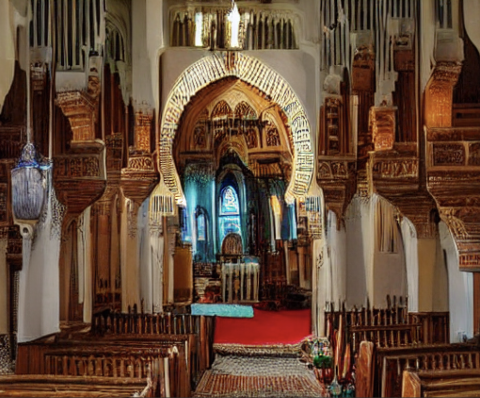
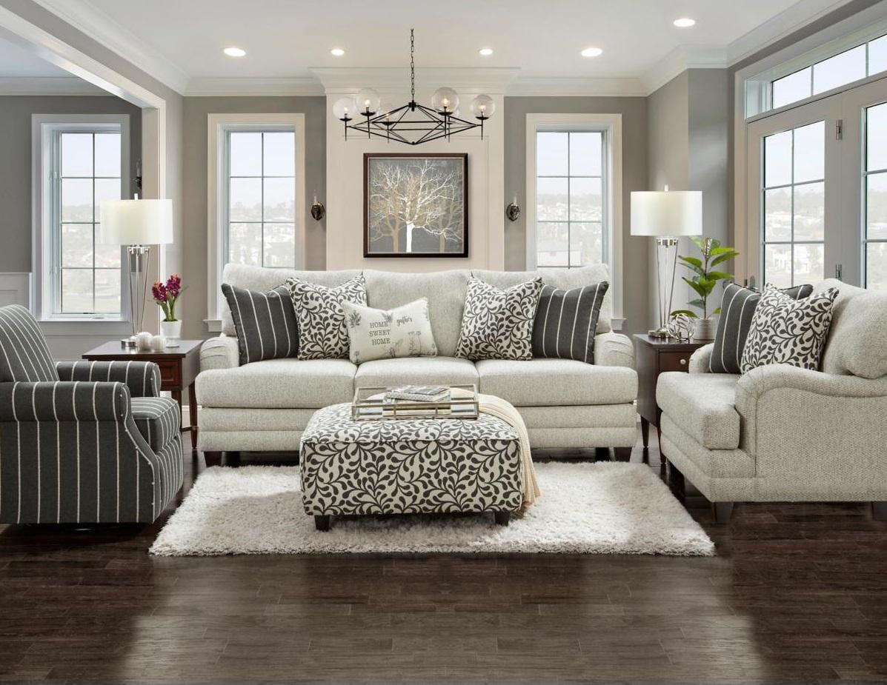

# Moroccan AI Interior Design 🇲🇦🦁
Moroccan Interior design generator using diffusion and ControlNet.
This project was made during the ThinkAI Hackathon made by 1337AI & Math-Maroc.


## Introduction
Diffusion models are a type of generative model that use the process of diffusion to generate realistic samples from a given distribution. They operate by iteratively "diffusing" noise or random input through a sequence of learned transformations, which are typically implemented as neural networks. At each diffusion step, the noise is gradually transformed to create a more complex and detailed representation of the target distribution. By applying this process repeatedly, diffusion models can generate high-quality samples that capture the statistical properties of the underlying distribution. These models have shown promising results in a variety of domains, including image and text generation, and have the potential to be a powerful tool for data-driven applications.


## Use Case
This solution offers endless inspiration for interior design enthusiasts, from stylists seeking fresh ideas to individuals looking to refresh their living spaces. With a Moroccan spice, the program generates an array of interior designs made specially to your current room design. All you need to do is upload a photo of your space, and let the program do its magic.

## Techniques Used
Under the hood, our app relies on [ControlNet](https://github.com/lllyasviel/ControlNet), which is a neural network structure to control diffusion models (**In this case a fine-tuned diffusion models on Moroccan interior design**).

As a first step, we fine-tuned `CompVis/stable-diffusion-v1-4` on a dataset of (~200 images of [Moroccan living rooms](#)) using [DreamBooth].

- **Notebook** : https://colab.research.google.com/github/huggingface/diffusion-models-class/blob/main/hackathon/dreambooth.ipynb#scrollTo=b139c7fe-eec2-43fc-94da-ac4ecaae73f7
- **Model** : https://huggingface.co/medmac01/beldi-moroccan-interior-2

As a second step, we used the model together with [ControlNet model for canny edges](https://huggingface.co/lllyasviel/) through a Pipeline which we used later to generate images from image+text.

- **Notebook** : https://colab.research.google.com/drive/1KBZEeWUMcOy_fZygz25D9bPA-xvKcd_q#scrollTo=wsv55Py8onJx
- **Model** : https://huggingface.co/medmac01/moroccaninteriour-controlNet

```python
from diffusers import DiffusionPipeline
import torch
import cv2
import numpy as np

model_id = "medmac01/moroccaninteriour-controlNet"
pipeline = DiffusionPipeline.from_pretrained(model_id, torch_dtype=torch.float16)
pipeline = pipeline.to("cuda")

image = np.array(Image.open('path_to_image'))  # The Input Image

low_threshold = 150
high_threshold = 250

image = cv2.Canny(image, low_threshold, high_threshold)
image = image[:, :, None]
image = np.concatenate([image, image, image], axis=2)
canny_image = Image.fromarray(image)

output = pipeline(
    prompt,
    canny_image,
    negative_prompt=negative_prompt, 
    num_inference_steps=20,
).images[0]  
```

## Dataset && Preprocessing
In order to fine-tune our diffusion model, we collected a dataset of ~200 imgs of Moroccan interior designs. Theses images represent our class **'beldi'** that we trained our model on.

We first resized our images to (512,512) and then trained the model. But this approach was not efficient as our model learned to generate squeezed objects. The remedy was to crop the images and use every possible part of the image (so no data is lost :D)

## Results
- **DreamBooth** : Generating an image of a moroccan church
<p align="center"></p>
  
- **ControlNet**
  
*Original Image*

<p align="center"></p>
  
*Output Image*
<p align="center"></p>
